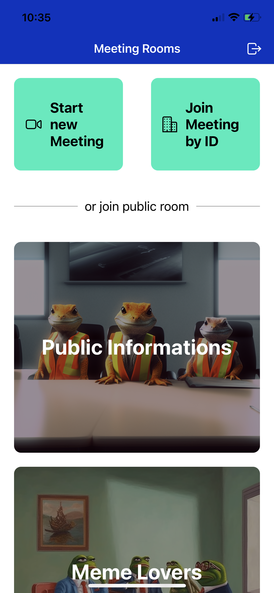
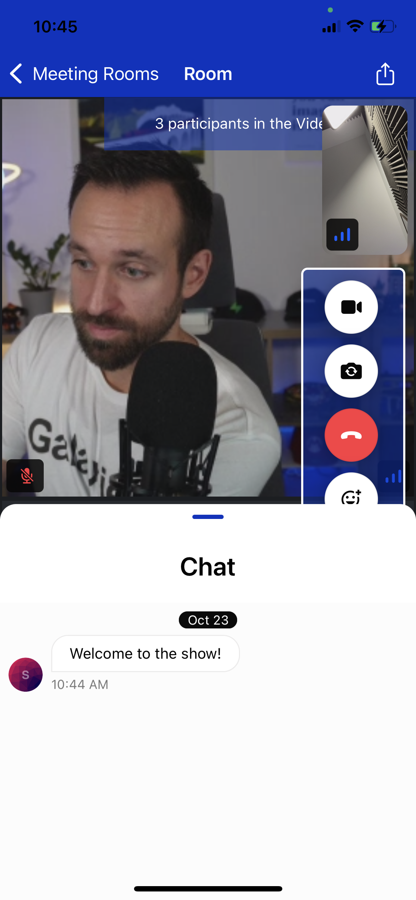
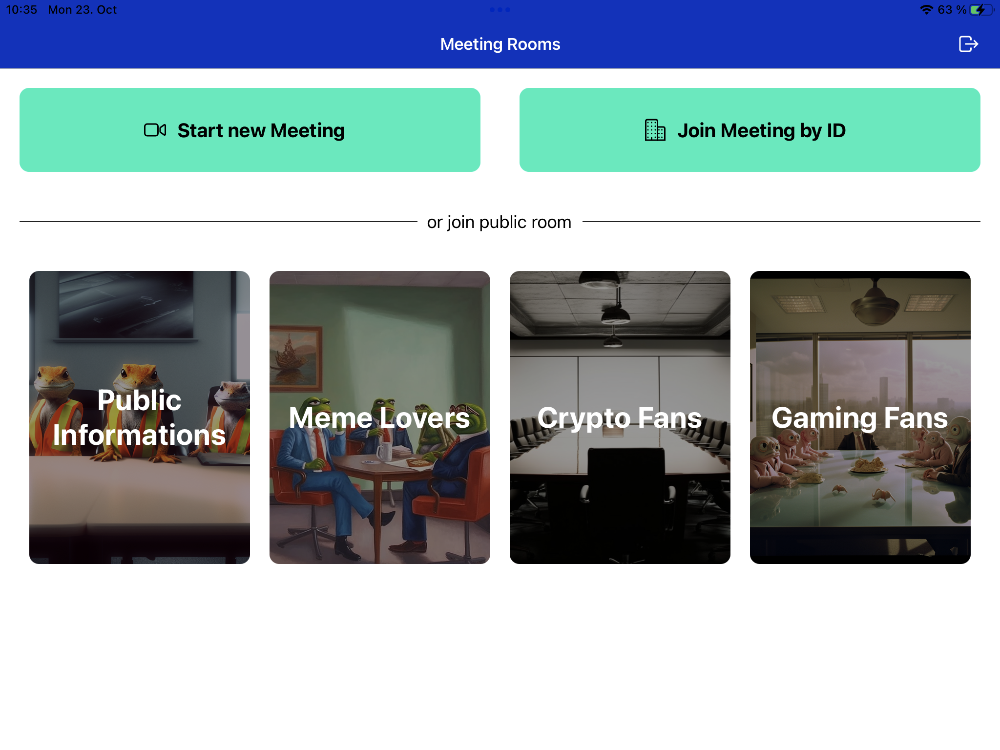

# Live Meeting React Native App with Stream Video Call & Chat Integration

This is a React Native app that uses [Stream](https://gstrm.io/devdactic-23-11) for live video calls and chat. It is built with Expo and uses a [Node API for authentication](https://github.com/Galaxies-dev/auth-api-stream).

It works on both iOS and Android, as well as table and phone-sized devices!

## App Screenshots

